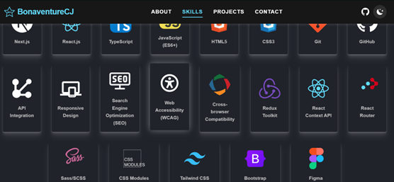

# BonaventureCJ's Portfolio Web Application 🚀


A personal portfolio webpage showcasing my projects, skills, and contact information. Built from the ground up to be a highly accessible, performant, and maintainable application, it serves as a central hub for my professional identity as a developer.

---

## 🌟 Key Features

This application was developed with a focus on modern web development best practices and robust user experience.

* **Truly Mobile Responsive Design:** Implements **Responsive Web Design (RWD) principles** for an optimal viewing experience across all devices, including a truly mobile-responsive navigation system.
* **Accessibility First:** Adheres strictly to **WCAG (Web Content Accessibility Guidelines)** with appropriate accessibility attributes and code, ensuring a broad and inclusive user base.
* **Performance & SEO:** Adheres to **SEO best practices** for better discoverability and utilizes **SVGs** for infinitely scalable and performant vector graphics.
* **Maintainable Architecture:** Features an excellent UI/UX, good architecture, **scalable** design, and highly **maintainable** code.
* **Styling & Theming:** Utilizes **SCSS** for advanced, modular styling, and includes a seamless **light-dark theme** toggle.
* **Modern Functionality:** Features professional-looking **animations**, **error handling**, and client-side routing via **React Router**.
* **Contact Functionality:** Includes a fully functional **contact form** for easy communication.
* **BEM Methodology:** Classnames are written following **BEM (Block Element Modifier) naming conventions** for clear, isolated, and scalable CSS.

---

## 🛠 Technology Stack & Rationale

| Technology | Purpose | Rationale |
| :--- | :--- | :--- |
| **React.js** | Front-end Library | Chosen for building a **Single-Page Application (SPA)**, leveraging its component-based architecture for composable, reusable, and efficient UI structures. |
| **SCSS (Sass)** | CSS Preprocessor | Used for **advanced and modular styling**, enabling features like variables, nesting, mixins, and functions, which significantly improves maintainability. |
| **React Router** | Routing Library | Essential for creating a rich SPA experience with **declarative routing** and creating deep-linkable URLs. |
| **React Context API** | State Management | Utilized for **managing global state**, specifically the light/dark theme state, for its lightweight nature and inbuilt structure in React. |
| **Git & GitHub** | Version Control | Leveraged for their **robustness** and industry-standard capabilities in collaboration, version tracking, and code management. |
| **SVGs** | Graphics | Incorporated for **scalability** and performance, ensuring visuals look crisp on any screen resolution without impacting load times. |

---

## 👨‍💻 Development & Contribution

### My Role

I personally **built the entire project** from conception to deployment, including design, development, and adherence to all best practices mentioned above.

### Setup Instructions

To get a local copy up and running, follow these simple steps:

1.  **Clone the repository:**
    ```bash
    git clone [https://github.com/BonaventureCJ/portfolio.git](https://github.com/BonaventureCJ/portfolio.git)
    cd portfolio
    ```

2.  **Install dependencies:**
    ```bash
    npm install
    ```

3.  **Run the development server:**
    ```bash
    npm start
    ```

**Note:** For the contact form to function, you will need to configure a service like [Formspree](https://formspree.io/) and set the corresponding endpoint in your environment variables or component code.

### Future Enhancements

I have the following improvements planned for the project:

* **TypeScript Migration:** To enhance code quality, predictability, and maintainability by introducing static typing.
* **Backend Integration:** To add a simple backend once I complete my study of backend technologies, allowing for more complex features (e.g., dynamic content, custom API).

---

## 📞 Get In Touch

I'm always open to discussing new projects, opportunities, or just sharing development insights. Feel free to connect via any of the links below!

| Service | Display | Link |
| :--- | :--- | :--- |
| **LinkedIn** (Featured) | Bonaventure Ugwu | [https://www.linkedin.com/in/bonaventure-ugwu](https://www.linkedin.com/in/bonaventure-ugwu) |
| **GitHub** (Featured) | BonaventureCJ | [https://github.com/BonaventureCJ](https://github.com/BonaventureCJ) |
| **Email** (Featured) | bonacjugwu@gmail.com | `mailto:bonacjugwu@gmail.com` |
| **X (Twitter)** | @BonaCJUgwu | [https://x.com/BonaCJUgwu](https://x.com/BonaCJUgwu) |
| **WhatsApp** | +234 806 110 3300 | [https://wa.me/+2348061103300](https://wa.me/+2348061103300) |
| **Phone/SMS** | +234 806 110 3300 | `sms:+2348061103300` |

---

## 🖼 Screenshots

